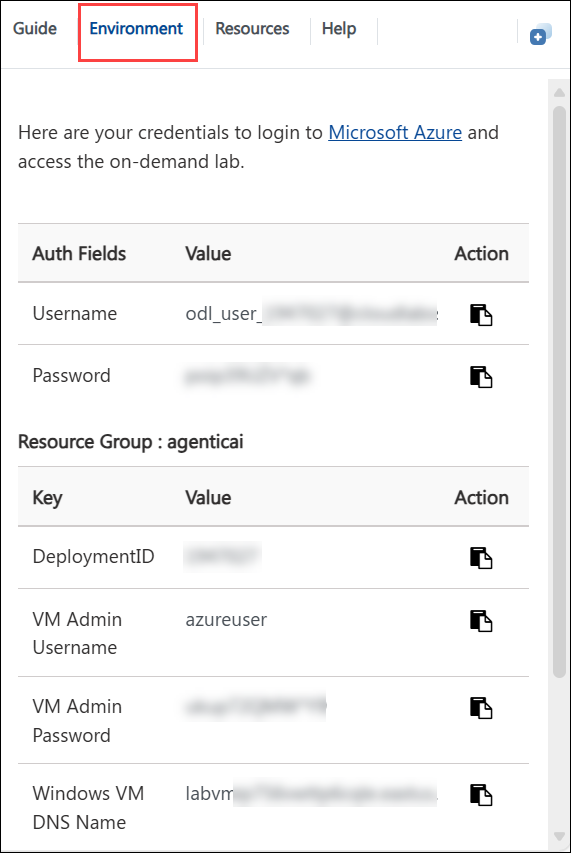
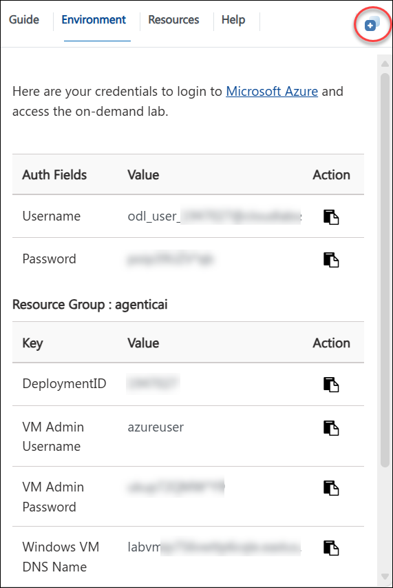
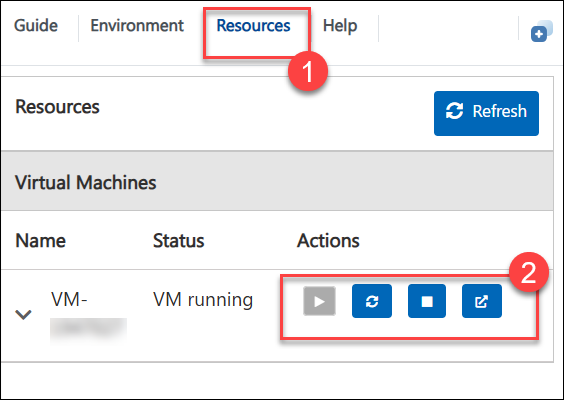
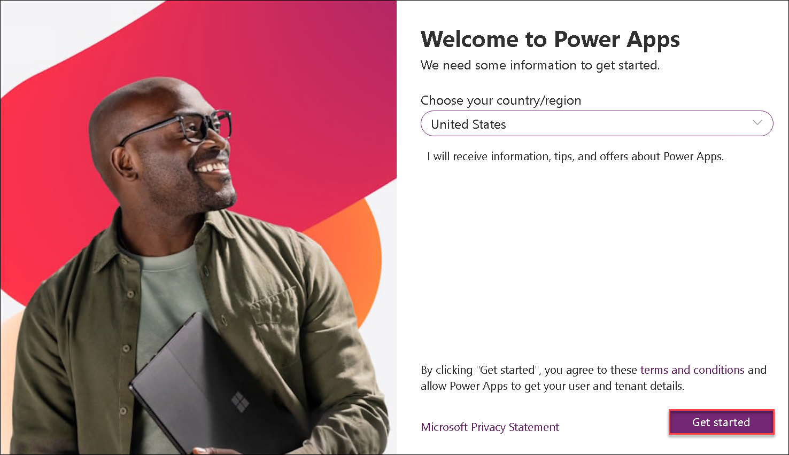
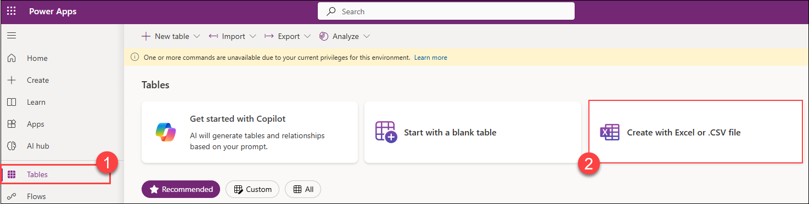
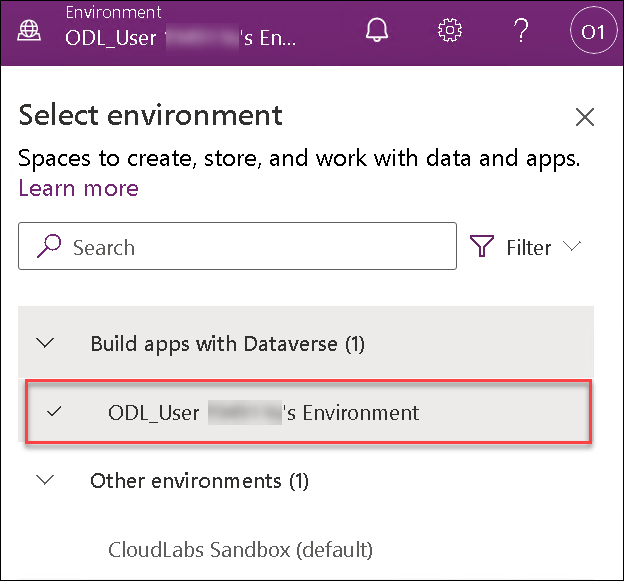

# Create a Knowledge Assistant agent for HR in Copilot Studio that leverages Azure AI Search

### Overall Estimated Duration : 1 Hour

## Overview:

This hands-on lab guides participants through the process of creating a **Knowledge Assistant agent for HR** in **Copilot Studio**, powered by **Azure AI Search** to deliver intelligent, context-aware responses to employee queries. Participants will learn how to connect Copilot Studio to enterprise knowledge sources, configure Azure AI Search for semantic retrieval, and design conversational flows that improve HR service efficiency. The lab emphasizes integrating generative AI with organizational data to streamline HR support and enhance employee experience through automation and natural language understanding.

## Objectives:

Learn to build and automate an HR-focused Knowledge Assistant by connecting **Copilot Studio** with **Azure AI Search** to access and interpret HR documents intelligently; configure **data ingestion pipelines** to index and retrieve information securely; design **natural conversation flows** that provide personalized and compliant responses; implement **prompt engineering techniques** to ensure accurate, context-driven answers; and apply **governance and security best practices** for responsible AI integration in enterprise environments.

**By the end of this lab, you will get insights on these concepts:**

* Building AI-powered assistants in Microsoft Copilot Studio.
* Integrating Azure AI Search for semantic content retrieval.
* Automating HR processes through intelligent conversational design.
* Managing enterprise data securely for generative AI use cases.
* Applying prompt design, testing, and optimization for reliable results.


## Pre-requisites

Participants should have the following prerequisites:

- **Familiarity with Azure Resources**: Basic understanding of Azure services and the Azure portal for managing cloud resources.

- **Knowledge of Copilot Studio**: Familiarity with Copilot Studio and its capabilities for building AI-driven solutions.

- **Understanding of HR Processes**: Basic knowledge of HR functions such as employee onboarding, policy queries, and internal support workflows.

- **Experience with AI and Search Concepts**: Awareness of how AI Search and natural language processing enhance information retrieval and user interaction.

## Getting Started with Lab

Welcome to Create a Knowledge Assistant agent for HR in Copilot Studio that leverages Azure AI Search Hands-On-Lab! , We've prepared a seamless environment for you to explore and learn. Let's begin by making the most of this experience.

>**Note:** If a PowerShell window appears once the environment is active, please don't close it. Minimize it instead of closing it and proceed with the tasks.

### Accessing Your Lab Environment

Once you're ready to dive in, your virtual machine and Lab guide will be right at your fingertips within your web browser.


### Exploring Your Lab Resources

To get a better understanding of your Lab resources and credentials, navigate to the **Environment** tab.



### Utilizing the Split Window Feature

For convenience, you can open the Lab guide in a separate window by selecting the Split Window button from the Top right corner



### Managing Your Virtual Machine

Feel free to start, stop, or restart your virtual machine as needed from the Resources tab. Your experience is in your hands!



## Let's Get Started with Azure Portal

1. In the JumpVM, click on **Azure portal** shortcut of Microsoft Edge browser which is created on desktop.

   

1. On the **Sign into Microsoft Azure** tab, you will see the login screen. Enter the provided email or username, and click **Next** to proceed.

   - Email/Username: <inject key="AzureAdUserEmail"></inject>

     

1. Now, enter the following password and click on **Sign in**.

   - Password: <inject key="AzureAdUserPassword"></inject>

     

1. If prompted to stay signed in, you can click **"Yes."**

1. If a **Welcome to Microsoft Azure** pop-up window appears, simply click **"Cancel"** to skip the tour.

## Let's Get Started with Power Apps Portal

1. Open a new browser tab, copy and paste the below link in the browser tab.

   ```
   https://make.powerapps.com/
   ```

1. On the **Welcome to Power Apps** page, select **Get Started**.

   

1. You have now successfully logged in to the Power Apps portal.

   

1. Once done, select **Tables (1)** from the left menu and click on **Create with Excel or .CSV file (2)**.

   

1. In the pop up window to create a environment, Click on **Create**. This will create a new power platform developer environment. On the **Create a table** page, select **Cancel**.

   

   

   > **Note:** The environment creation process may take some time. If an error occurs, please click Create again to ensure the developer environment is provisioned. If the issue persists, kindly reach out so that an administrator can create the environment on your behalf, allowing you to continue with the lab.

   > You are signing up through the Power Apps portal to assign the Power Apps Developer Plan to the user, ensuring a smooth environment creation process.

1. Once done, you can close the Power Apps window and move to the further exercises.

## Support Contact

The CloudLabs support team is available 24/7, 365 days a year, via email and live chat to ensure seamless assistance at any time. We offer dedicated support channels tailored specifically for both learners and instructors, ensuring that all your needs are promptly and efficiently addressed.Learner Support Contacts:

- Email Support: cloudlabs-support@spektrasystems.com
- Live Chat Support: https://cloudlabs.ai/labs-support

Now, click on the **Next** from lower right corner to move on next page.

## Happy Learning!!

