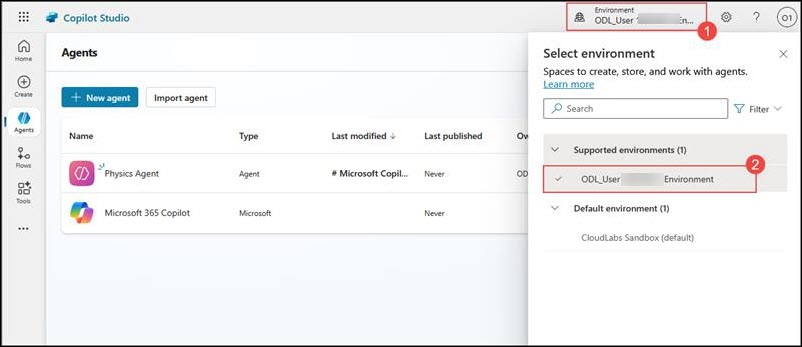
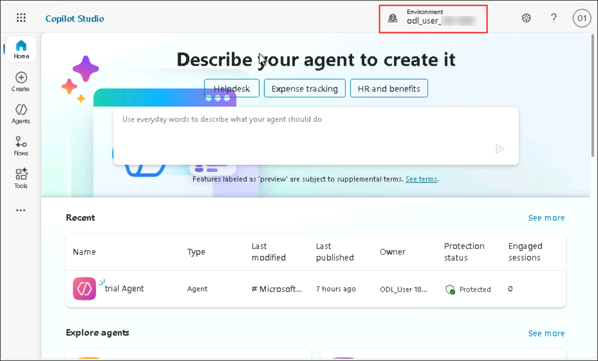

# Lab 1: Getting Started with Automation and Copilot Studio

## Overview

This exercise introduces the fundamental concepts of automation and guides you through the essential features of Copilot Studio. You will learn how to create, configure, and manage automated workflows, gaining hands-on experience with the tools that streamline repetitive tasks and enhance productivity. By the end of this exercise, you’ll understand how automation can be leveraged to improve efficiency and integrate intelligent assistance into everyday processes.

## Objectives

You will be able to complete the following tasks:

- Task 1: Setting Up an Environment for Copilot Studio

### Task 1: Setting Up an Environment for Copilot Studio

In this task, you will log in to Copilot Studio.

1. Navigate to **Copilot Studio**  in a new tab using this link: [copilot studio](https://go.microsoft.com/fwlink/p/?linkid=2252408&clcid=0x409&culture=en-us&country=us)

1. On Welcome to Microsoft Copilot Studio page, Click on **Get Started**.

   

1. If the **Welcome to Copilot Studio** prompt appears, click **Skip**.
 
1. Once you are inside **Copilot Studio** you will be in the home page. 

   

1. Switch the new **odl_user_<inject key="DeploymentID" enableCopy="false" />_env** from the top right of the browser window.

   

   

## Summary

In this exercise, you explored the fundamentals of automation and the key features of Copilot Studio. You learned how to design, configure, and manage automated workflows to streamline repetitive tasks and enhance productivity. This hands-on experience demonstrated how automation can be applied to real-world scenarios to improve efficiency and integrate intelligent assistance into daily operations.

### You have successfully completed this Exercise!