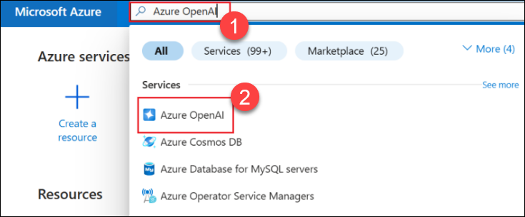
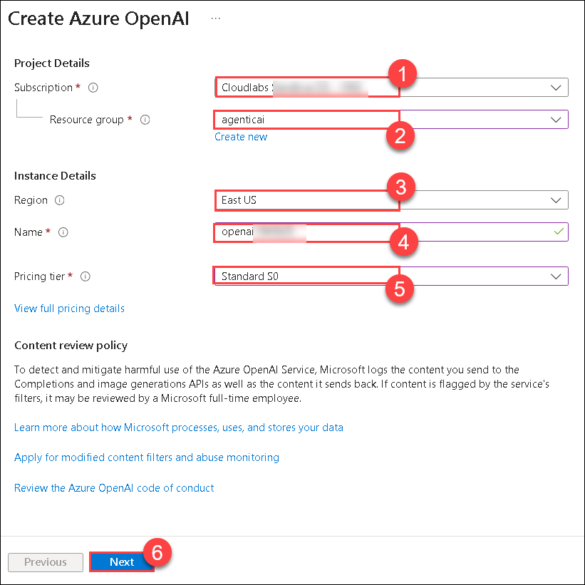
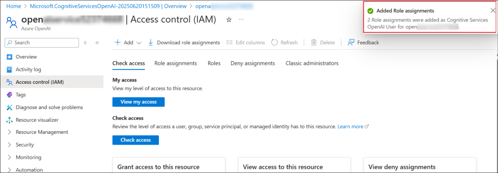
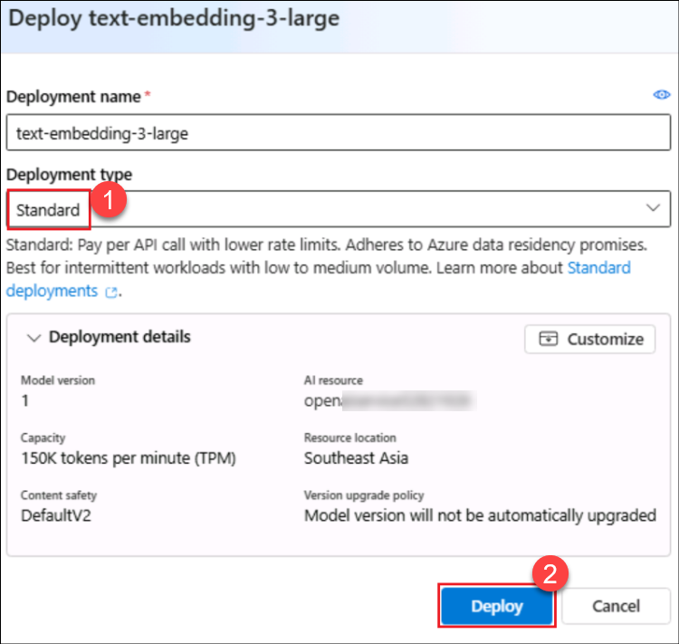

# Lab 02: Create a Knowledge Assistant agent for HR in Copilot Studio that leverages Azure AI Search

### Estimated Duration: 

## Lab Overview
In this lab, you will explore

## Lab Objective

In this lab, you will perform the following:
- Task 1: Create an Azure AI Search resource
  
## Task 1: Create an Azure AI Search resource

In this task, you will create an Azure AI Search resource from the
Azure portal. This will be used to search the documents using AI
capability.

**Azure AI Search** is a cloud-based service for searching within your
privately curated data. It uses a combination of Microsoft’s AI and
JSON-based indexes to provide fast, relevant search results.

1.  Open a edge browser and login to Azure portal with your credentials.

    - Username - <+++@lab.CloudPortalCredential>(User1).Username+++

    - Password - <+++@lab.CloudPortalCredential>(User1).Password+++

1. From the Home page of the Azure portal, select **Azure AI Foundry.**

    

2. In the **AI Foundry page**, select **AI Search (1)** under **Use with AI Foundry** from the left pane and then select **+ Create (2)**.

    

3.  Enter the below details and select **Review + create (5)**.

    - Subscription – Select your **assigned subscription (1)**

    - Resource group – Select your **assigned Resource
      group (2)**

    - Service name – **searchervice<inject key="DeploymentID" enableCopy="false"/> (3)**

    - Location – **Keep it as default (4)**

        

4.  Once the validation passes, select **Create**.

    

5.  The deployment takes around few minutes to complete. Select **Go to resource** once the search service is created.

    

6.  From the **Overview** page, copy the **Url** value and save it in a notepad to be used in a future exercise.

    

7.  Select **Keys (2)** under **Settings (1)** from the left pane. Copy the **Primary admin key (3)** and save it in a notepad for using it in the upcoming exercises.

    

8.  Select **Identity (2)** under **Settings (1)** from the left pane.

    

9.  Toggle the Status to **On (1)** under **System assigned** and then click on **Save (2)**.

    

10. Select **Yes** in the **Enable system assigned managed identity** confirmation dialog.

    

## Task 2: Create a Storage account

1.  From the Azure portal Home page, select **Storage accounts**.

    

2.  Select **+ Create** to create a new Storage account.

    

3.  Enter the below details, accept the default values in the other fields and click on **Review + create (5)**.

    - Subscription – Select your **assigned subscription (1)**

    - Resource group – Select your **assigned Resource group (2)**

    - Storage account name - **storage<inject key="DeploymentID" enableCopy="false"/> (3)**

    - Region – Keep it as default

    - Preferred storage type – Select **Azure Blob Storage or Azure Data Lake Storage Gen 2 (4)**

        

4.  Once the validation passes, click on **Create**.

    

5.  Once the resource creation succeeds, click on **Go to resource**.

    

6.  Select **Containers (1)** under **Data storage**. Select **+ Add Container (2)**, enter the name as **document (3)** and click on **Create (4)** to create the container.

    

7.  Select the created container **document** to upload the leave policy document into it.

    

8.  Click on **Upload (1)** and then select **Browse for files (2)**.

    

9.  Select the **LeavePolicy.docx** from **C:\Users\azureuser** and then click on **Upload**.

    

    

10. Navigate to the storage account and select **Access Control (IAM) (1)** from the left pane. Select **+ Add (2) -> Add role assignment (3)**.

    

11. Search for **Storage Blob Data Reader (1)**, select it **(2)** and click on **Next (3)**.

    

12. Make sure **User, group or service principal (1)** is selected, click on **+ Select members (2)**, **search (3)** for and select **<inject key="AzureAdUserEmail"></inject> (4)**, and then click on **Select (5)**. This adds the Storage Blob Data Reader role to your user id.
    

13. Select **Managed identity (1)** and then select **+ Select members (2)**. Select **Search service (3)** under **Managed identity** and select the **searchservice<inject key="DeploymentID" enableCopy="false"/> (4)** search service that gets listed. Click on **Select (5)**

    

14. Back in the Add role assignment screen, click on **Review + assign**.

    

15. Select **Review + assign** again in the next screen.

    

16. Proceed to the next step once the roles are added.

    

In this exercise, we have created a Storage account and added the
document and required Role permissions to it.

## Task 3: Create an Azure OpenAI Service and deploy a model

1. From the Azure portal Home page, search for and select **Azure OpenAI**.

    

2. On the **AI Foundry | Azure OpenAI** select **+ Create (1)** and from the drop-down select **Azure OpenAI (2)**.

    

3.  Enter the below details and select **Next (6)**.

    - Subscription – Select your **assigned subscription (1)**

    - Resource group – Select your **assigned Resource group (2)**

    - Region – **Keep it as default (3)**

    - Name – **openai<inject key="DeploymentID" enableCopy="false"/> (4)**

    - Pricing tier – Select **Standard S0 (5)**

        

4. Select **Next** in the next 2 screens. select **Create** in the **Review + submit** screen.

    

5.  Click on **Go to resource** once the service is created.

    

6. Select **Access control (IAM) (1)** from the left pane, select **+ Add (2) -\> Add role assignment (3)**.

    

7. Search for **Cognitive Services OpenAI User (1)**, **select (2)** the role and click on **Next (3)**.

    

8. Make sure **User, group or service principal (1)** is selected, click on **+ Select members (2)**, **search (3)** for and select **<inject key="AzureAdUserEmail"></inject> (4)**, and then click on **Select (5)**. This adds the Storage Blob Data Reader role to your user id.
    

9. Select **Managed identity (1)** and then select **+ Select members (2)**. Select **Search service (3)** under **Managed identity** and select the **searchservice<inject key="DeploymentID" enableCopy="false"/> (4)** search service that gets listed. Click on **Select (5)**

    

10. Select **Next** in next 2 screens and on the **Review + assign** page, select **Review + assign**.

    

11. Wait for a **success** message on the role additions before proceeding with the next tasks.

    

12. From the **Overview (1)** page of the Azure OpenAI Service resource, select **Go to Azure AI Foundry portal (2)** to open the Azure OpenAI Service there and deploy a model.

    

13. On the **Azure AI Foundry** portal, select **Deployments** from the left pane.

    

14. On the **Model deployments** page, select **+ Deploy model (1)** -\> **Deploy base model (2)**.

    

15. Search for **text-embedding (1)**, select **text-embedding-3-large (2)** and then select **Confirm (3)**.

    

16. Select **Deployment type** as **Standard (1)** and then select **Deploy (2)** in the **Deploy text-embedding-3-large** screen.

    

17. The model gets deployed and the screen is loaded with the deployment
    details.

    

## Task 4: Create a vector index

1.  Navigate back to the Azure portal, open the **searchservice<inject key="DeploymentID" enableCopy="false"/>** AI Search service resource that we created in the previous task.

    

2. On the **Overview** page, select **Import data (new)**.

    

3. On the **Import data (new)** page, select the **Azure Blob Storage** option.

    

4. Select the **RAG** option on the **What scenarios are you targeting?** page.

    

5.  Enter the below details, accept the other values as default and click **Next (4)**.

    - Subscription – Select your **assigned subscription (1)**

    - Storage account- Select **storage<inject key="DeploymentID" enableCopy="false"/> (2)**

    - Blob container – Select **document (3)**

        

6.  In the Vectorize your text screen, the **subscription (1)** is pre-populated. Enter the below details and click **Next (6)**.

    - Azure OpenAI Service – **openai<inject key="DeploymentID" enableCopy="false"/> (2)**

    - Model deployment – Select **text-embedding-3-large (3)**

    - Authentication type – Select **System assigned identity (4)**

    - Select the checkbox to **acknowledge that connecting to an Azure OpenAI service will incur additional costs to my account (5)**.

        

7.  Select Next in the **Vectorize and enrich your images** screen since we are not dealing with images here and select **Next** in the **Advanced settings** screen as well.

    .png)
    
    

8.  Select **Create** in the **Review + create** screen.

    

9.  Click on **Close** in the success dialog box.

    

## Task 5: Create a knowledge assistant agent

1.  Open a new broser and login to [https://copilotstudio.microsoft.com](https://copilotstudio.microsoft.com/) using your login credentials.

2.  Select **Get Started** in the Welcome to Microsoft Copilot Studio.

    

    

3.  The agent creation page gets opened. Describe the agent in the **Describe** tab. Enter **You are a Knowledge assistant agent
for HR who will answer questions related to leaves and leave policies to the employees** and select **Send**.

    

4.  The copilot suggests a name to the agent. Click on **Create** to create the agent.

    

5.  Once the agent is created, in the **Test** pane, enter **How many days of Maternity leaves can I avail? (1)** and click **Send (2)**

    

6.  It gives a generalized reply as in the screenshot below.

    

## Task 6: Add the Azure AI Search as a knowledge source

1.  From the **Overview** page of the agent, select **Add knowledge**.

    

2.  Select Azure AI Search from the list of knowledge sources available.

    

3.  Click on the **drop down** next to **Not connected** in the next
    screen and select **Create new connection**.

    

4.  Enter the **Endpoint url** and the **Admin key** values which we
    saved to a notepad in a previous exercise and then click
    on **Create** to create the connection.

    

5.  Once the connection is established, the available index is listed
    and already selected. Click on **Add to agent**.

    

6.  The AI Search service is added as a knowledge source to the agent
    and is in **Ready** state now. Ensure that the **Web search** option
    is **disabled** in the Knowledge section.

    

7.  Now, let us test the agent with the same question we tried before.

8.  In the Test pane, enter +++How many days of Maternity leaves can I
    avail?+++ and click **Send.**

    

9.  You can see that the response from the agent now is from the
    document uploaded in the AI Search service.

    

   
## Summary
In this lab, you have completed the following tasks:
- 

### You have successfully completed the lab. Click on **Next >>** to proceed with the next Lab.

