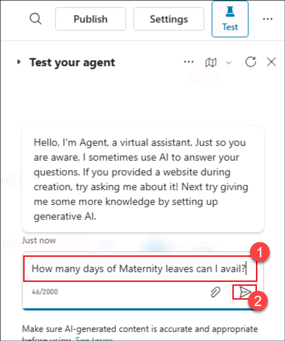

# Lab 02: Create a Knowledge Assistant agent for HR in Copilot Studio

## Overview
In this lab, you will explore how to design and implement an intelligent **HR Knowledge Assistant** using **Copilot Studio** integrated with **Azure AI Search** to enable dynamic, data-driven employee interactions. You will learn how to connect enterprise HR knowledge bases, configure semantic search for precise information retrieval, and create conversational experiences that respond naturally to employee queries. This lab focuses on building a scalable and secure AI-powered assistant that enhances HR operations by automating common inquiries, improving accessibility to organizational information, and demonstrating how generative AI can transform employee support systems.

## Objective

In this lab, you will perform the following:
- Task 1: Create an Azure AI Search resource
- Task 2: Create a Storage account
- Task 3: Create a vector index
- Task 4: Create a knowledge assistant agent
- Task 5: Add the Azure AI Search as a knowledge source
  
## Task 1: Create an Azure AI Search resource

In this task, you will be used to search the documents using AI capability. **Azure AI Search** is a cloud-based service for searching within your privately curated data. It uses a combination of Microsoft’s AI and JSON-based indexes to provide fast, relevant search results.

1.  Open a edge browser and login to Azure portal with your credentials.

    - Username - <inject key="AzureAdUserEmail"></inject>

    - Password - <inject key="AzureAdUserPassword"></inject>

1. From the Home page of the Azure portal, select **Azure AI Foundry.**

    

2. In the **AI Foundry page**, select **AI Search (1)** under **Use with AI Foundry** from the left pane. Select the **searchservice-<inject key="DeploymentID" enableCopy="false"/> (2)** AI search which is pre-created.

    

3.  From the **Overview** page, copy the **Url** value and save it in a notepad to be used in a future exercise.

    

4.  Select **Keys (2)** under **Settings (1)** from the left pane. Copy the **Primary admin key (3)** and save it in a notepad for using it in the upcoming exercises.

    

5.  Select **Identity (2)** under **Settings (1)** from the left pane.

    

6.  Toggle the Status to **On (1)** under **System assigned** and then click on **Save (2)**.

    

    >**Note:** If it is already **On**, then please proceed to the next task.

7. Select **Yes** in the **Enable system assigned managed identity** confirmation dialog.

    

## Task 2: Create a Storage account
In this task, you will be using a **pre-existing Azure Storage account** that has been set up to store HR-related documents and resources. You will review its configuration to understand how data is organized and prepared for integration with **Azure AI Search**. This step ensures you are familiar with the storage structure, container access, and data types available, which will be essential for connecting and indexing the content in later tasks to power the HR Knowledge Assistant.

1. In the Azure portal Home page, go to **Storage accounts**, and select the pre-existing storage account named **storage<inject key="DeploymentID" enableCopy="false"/>** that was created earlier.

    

2.  Select **Containers (1)** under **Data storage** from the left navigation menu. Select **document (2)** container, to upload the leave policy document into it.

    

3.  Click on **Upload (1)** and then select **Browse for files (2)**.

    

4.  Select the **LeavePolicy.docx** from **C:\datasets\CloudLabsAI-Azure-Knowledge_Assistant_Agent-43015a3** and then click on **Upload**.

    

    

## Task 3: Create a vector index
In this task, you will be creating a **vector index** in **Azure AI Search** to enable intelligent, semantic search capabilities for your HR Knowledge Assistant. You will configure the index to process both text and embedded vector data, allowing the assistant to understand the context and meaning behind employee queries rather than relying solely on keyword matching. This setup will enhance the accuracy and relevance of responses by leveraging AI-powered embeddings, ensuring that the HR assistant can deliver precise and context-aware answers from the connected data sources.

1.  Navigate back to the Azure portal, open the **searchservice-<inject key="DeploymentID" enableCopy="false"/>** AI Search service resource that we created in the previous task.

    

2. On the **Overview** page, select **Import data (new)**.

    

3. On the **Import data (new)** page, select the **Azure Blob Storage** option.

    

4. Select the **RAG** option on the **What scenarios are you targeting?** page.

    

5.  Enter the below details, accept the other values as default and click **Next (4)**.

    - Subscription – Select your **assigned subscription (1)**

    - Storage account- Select **storage<inject key="DeploymentID" enableCopy="false"/> (2)**

    - Blob container – Select **document (3)**

        

6.  In the Vectorize your text screen, the **subscription (1)** is pre-populated. Enter the below details and click **Next (6)**.

    - Azure OpenAI Service – **openai-<inject key="DeploymentID" enableCopy="false"/> (2)**

    - Model deployment – Select **text-embedding-ada-002 (3)**

    - Authentication type – Select **System assigned identity (4)**

    - Select the checkbox to **acknowledge that connecting to an Azure OpenAI service will incur additional costs to my account (5)**.

        

7.  Select Next in the **Vectorize and enrich your images** screen since we are not dealing with images here and select **Next** in the **Advanced settings** screen as well.

    .png)
    
    

8.  Select **Create** in the **Review + create** screen.

    

9.  Click on **Close** in the success dialog box.

    

## Task 4: Create a knowledge assistant agent
In this task, you will be creating a **Knowledge Assistant agent** in **Copilot Studio** that connects to your **Azure AI Search** vector index to deliver intelligent, conversational responses to HR-related queries. You will configure the agent’s behavior, link it to the search index, and design simple conversation flows, enabling the assistant to retrieve and present accurate, context-aware information from HR knowledge sources.

1.  Open a new broser and login to [https://copilotstudio.microsoft.com](https://copilotstudio.microsoft.com/) using your login credentials.

2.  Select **Get Started** in the Welcome to Microsoft Copilot Studio.

    

    

    >**Note:** Make sure that you are in the correct enviornment which you created in **Lab-01**.
    
    

3.  The agent creation page gets opened. Describe the agent in the **Describe** tab. Enter **You are a Knowledge assistant agent
for HR who will answer questions related to leaves and leave policies to the employees** and select **Send**.

    

4.  The copilot suggests a name to the agent. Click on **Create** to create the agent.

    

5.  Once the agent is created, in the **Test** pane, enter **How many days of Maternity leaves can I avail? (1)** and click **Send (2)**

    

6.  It gives a generalized reply as in the screenshot below.

    

## Task 5: Add the Azure AI Search as a knowledge source
In this task, you will be adding **Azure AI Search** as a **knowledge source** for your **HR Knowledge Assistant** in **Copilot Studio**. You will connect the assistant to the existing search service by providing the endpoint, index name, and authentication key, allowing it to retrieve relevant HR information dynamically. This integration enables the assistant to leverage semantic search capabilities, ensuring responses are accurate, contextually relevant, and based on the most up-to-date organizational data.

1.  From the **Overview** page of the agent, select **Add knowledge**.

    

2. Select Azure AI Search from the list of knowledge sources available.

    

3.  Click on the **drop down** next to **Not connected** in the next screen and select **Create new connection**.

    

4.  Enter the **Endpoint url** and the **Admin key** values which we saved to a notepad in a previous exercise and then click on **Create** to create the connection.

    

5.  Once the connection is established, the available index is listed and already selected. Click on **Add to agent**.

    

6.  The AI Search service is added as a knowledge source to the agent and is in **Ready** state now. Ensure that the **Web search** option is **disabled** in the Knowledge section.

    

7.  Now, let us test the agent with the same question we tried before.

8.  In the Test pane, enter **How many days of Maternity leaves can I avail?** and click **Send.**

    

9.  You can see that the response from the agent now is from the document uploaded in the AI Search service.

    

   
## Summary
In this lab, you have completed the following tasks:
- Created an Azure AI Search resource
- Created a Storage account
- Created a vector index
- Created a knowledge assistant agent
- Added the Azure AI Search as a knowledge source

### You have successfully completed the lab.
